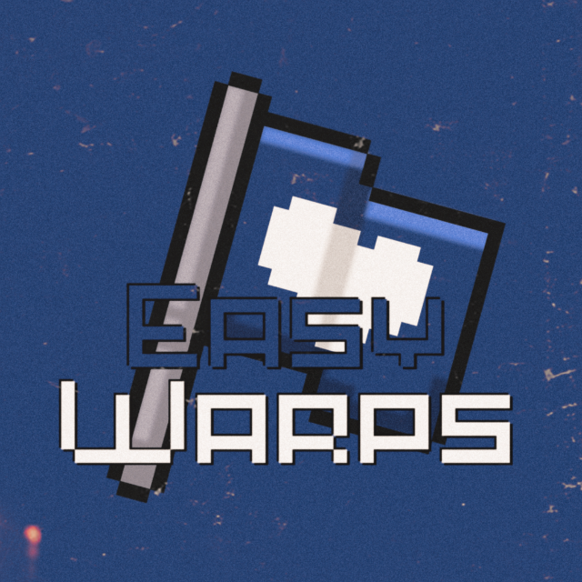

# <h3 align="center"></h3> 
 
## Description
_The `EasyWarps` is a simple plugin to set teleport points on worlds to make it easier for players to get around!._

- - - -
## Downloads
Download the **[ZIP](https://github.com/ImperaZim/EasyWarps/archive/refs/heads/main.zip)** version of the plugin and its dependencies **[EasyLibrary](https://github.com/ImperaZim/EasyLibrary/archive/refs/heads/main.zip)** and upload it to your server quickly and easily!

- - - -
## Software support
**[EasyWarps](https://github.com/ImperaZim/EasyWarps)** is a PHP plugin for **[PocketMine-MP](https://github.com/pmmp/PocketMine-MP )**, designed specifically for versions 5.17.0 and higher. It may not work on older versions or other webserver APIs! 

----
## For developers
 The plugin provides some public events to be used in other plugins such as:
-  [WarpCreateEvent](https://github.com/ImperaZim/EasyWarps/blob/main/src/imperazim/warp/event/WarpCreateEvent.php): **Always** called when an admin creates a new warp.
-  [WarpDeleteEvent](https://github.com/ImperaZim/EasyWarps/blob/main/src/imperazim/warp/event/WarpDeleteEvent.php): **Always** called when an admin deletes a warp.
-  [WarpTeleportEvent](https://github.com/ImperaZim/EasyWarps/blob/main/src/imperazim/warp/event/WarpTeleportEvent.php): **Always** called when a player teleports to a warp.

----
## Licensing information
This project is licensed under MIT. Please see the [LICENSE](/LICENSE) file for details.